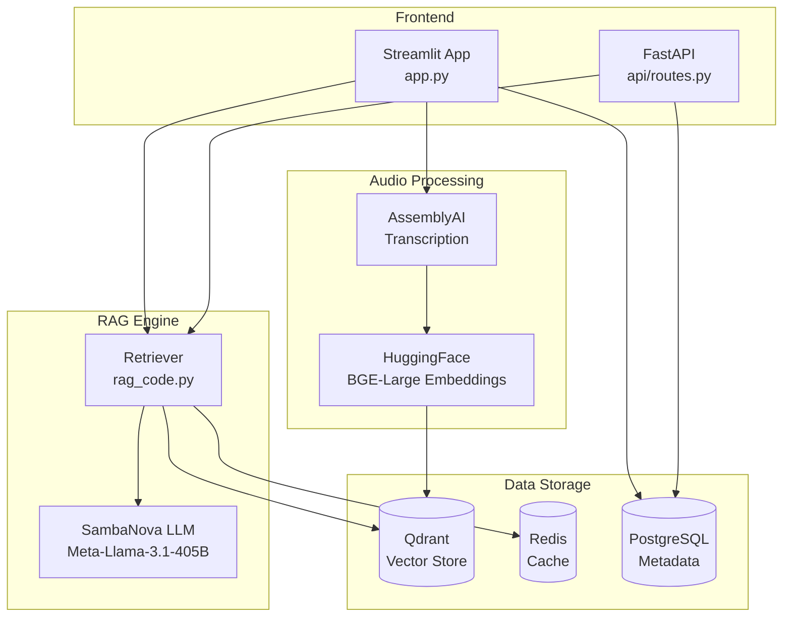
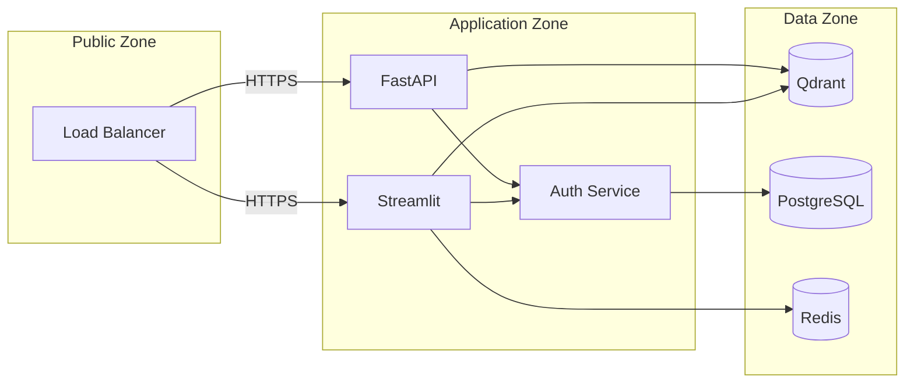

# AudioRAG Architecture Overview

## System Components



## Data Flow

### Audio Upload Flow
```
1. User uploads audio file (MP3/WAV/M4A)
2. File validated (size < 50MB, format check)
3. Temporary file created
4. AssemblyAI transcribes with speaker diarization
5. Transcript segmented into utterances
6. BGE-Large generates embeddings (1024 dim)
7. Embeddings stored in Qdrant
8. Metadata stored in PostgreSQL
```

### Query Flow
```
1. User enters natural language query
2. Query embedded using same BGE-Large model
3. Qdrant searched for top-k similar segments
4. Retrieved segments form context
5. Prompt constructed with context + query
6. SambaNova LLM generates streaming response
7. Response displayed with source attribution
```

## Component Details

### Embedding Model
- **Model:** BAAI/bge-large-en-v1.5
- **Dimensions:** 1024
- **Batch Size:** 32
- **Cache:** Local HuggingFace cache (`./hf_cache`)

### Vector Database
- **Technology:** Qdrant
- **Distance Metric:** Cosine
- **Quantization:** Binary (for memory efficiency)
- **Index Threshold:** 10,000 vectors

### LLM Configuration
- **Model:** Meta-Llama-3.1-405B-Instruct
- **Provider:** SambaNova Cloud
- **Temperature:** 0.7
- **Max Tokens:** 1024
- **Fallback:** OpenAI GPT-3.5-turbo

## Security Architecture



## Deployment Options

| Environment | Components | Notes |
|-------------|------------|-------|
| Development | Docker Compose | All services local |
| Staging | Kubernetes | Mirrored from prod |
| Production | Kubernetes + Managed DB | High availability |

## Performance Considerations

1. **Embedding Caching**: Cache embeddings for frequently queried content
2. **Connection Pooling**: Use SQLAlchemy pools for PostgreSQL
3. **Async Processing**: Batch jobs run asynchronously
4. **Index Optimization**: Tune Qdrant indexing threshold based on data size
