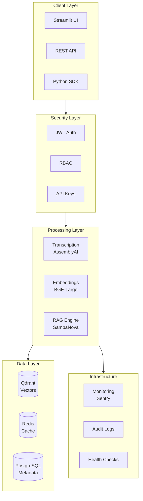
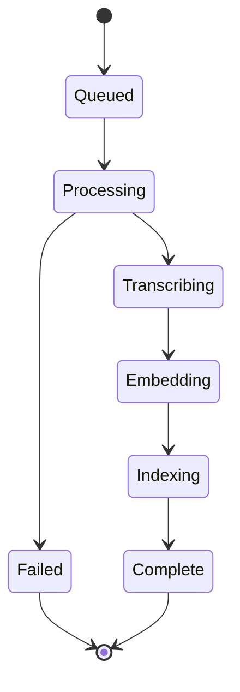

# AudioRAG Product Development Document (PRD)

## 📋 Executive Summary

**Product Name:** AudioRAG Enterprise  
**Version:** 2.0  
**Author:** Hemant Sudarshan  
**Last Updated:** January 5, 2026  

AudioRAG is an AI-powered audio analytics platform that transforms audio content into searchable, queryable insights using Retrieval-Augmented Generation (RAG). This PRD outlines the enterprise features and architecture for scaling the product.

---

## 🎯 Product Vision

Enable enterprises to unlock insights from audio data at scale through:
- **Intelligent transcription** with speaker diarization
- **Semantic search** over audio content
- **Natural language querying** with LLM-powered responses
- **Multi-tenant, secure, and compliant** infrastructure

---

## 🏗️ System Architecture



---

## 🚀 Feature Specifications

### 1. Authentication & Authorization

| Feature | Description | Priority |
|---------|-------------|----------|
| JWT Authentication | Secure token-based auth with refresh tokens | P0 |
| RBAC | Roles: Admin, Analyst, Viewer | P0 |
| API Keys | For programmatic access and integrations | P1 |
| SSO Integration | SAML/OAuth2 for enterprise SSO | P2 |

**User Roles:**
- **Admin**: Full access, user management, billing
- **Analyst**: Upload audio, query, export reports
- **Viewer**: Read-only access to transcripts and reports

---

### 2. Multi-Tenant Architecture

| Feature | Description | Priority |
|---------|-------------|----------|
| Organization Isolation | Separate data per organization | P0 |
| Per-Tenant Collections | Isolated Qdrant collections | P0 |
| Usage Quotas | Storage and processing limits | P1 |
| Billing Integration | Usage tracking for billing | P2 |

**Data Isolation Strategy:**
- Tenant ID embedded in all database records
- Separate Qdrant collection per tenant: `{collection_name}_{tenant_id}`
- Row-level security in PostgreSQL

---

### 3. Analytics Dashboard

| Metric | Description |
|--------|-------------|
| Audio Processed | Total hours of audio transcribed |
| Active Users | Daily/Weekly/Monthly active users |
| Query Volume | Number of queries per time period |
| Response Time | Average LLM response latency |
| Accuracy Score | User feedback on response quality |

**Reports:**
- Daily/Weekly usage summary
- Cost breakdown per tenant
- Performance trends
- Export to PDF/CSV/Excel

---

### 4. Batch Processing

| Feature | Description | Priority |
|---------|-------------|----------|
| Bulk Upload | Upload multiple files at once | P0 |
| Background Jobs | Async processing with progress tracking | P0 |
| Scheduling | Cron-based scheduled processing | P1 |
| Webhooks | Notify on job completion | P1 |

**Processing Pipeline:**


---

### 5. Caching Strategy

| Cache Type | TTL | Use Case |
|------------|-----|----------|
| Embedding Cache | 24h | Repeated queries on same content |
| Query Cache | 1h | Frequently asked questions |
| Session Cache | 30m | User session data |

**Technology:** Redis with LRU fallback

---

### 6. REST API

| Endpoint | Method | Description |
|----------|--------|-------------|
| `/api/audio` | POST | Upload audio file |
| `/api/audio/{id}` | GET | Get transcript |
| `/api/query` | POST | Query audio content |
| `/api/batch` | POST | Submit batch job |
| `/api/analytics` | GET | Usage analytics |

**Rate Limits:**
- Free tier: 100 requests/hour
- Pro tier: 1,000 requests/hour
- Enterprise: Custom limits

---

### 7. Audit & Compliance

| Feature | Description |
|---------|-------------|
| Audit Logs | All user actions logged immutably |
| GDPR Export | Export all user data on request |
| Data Retention | Configurable retention policies |
| Access Reports | Who accessed what, when |

---

### 8. Error Monitoring

| Component | Tool |
|-----------|------|
| Error Tracking | Sentry |
| APM | OpenTelemetry |
| Logging | Structured JSON logs |
| Alerting | Slack/PagerDuty integration |

**Health Endpoints:**
- `GET /health` - Liveness probe
- `GET /ready` - Readiness probe (includes DB connectivity)

---

## 📊 Technical Requirements

### Infrastructure

| Component | Development | Production |
|-----------|-------------|------------|
| Database | SQLite | PostgreSQL 15+ |
| Vector Store | Qdrant (Docker) | Qdrant Cloud |
| Cache | In-memory | Redis 7+ |
| Queue | In-process | Redis + Celery |

### Performance Targets

| Metric | Target |
|--------|--------|
| Transcription | < 0.5x real-time |
| Query Latency | < 2 seconds |
| Uptime | 99.9% |
| Concurrent Users | 100+ |

### Security Requirements

- TLS 1.3 for all connections
- Encrypted at rest (AES-256)
- SOC 2 Type II compliance ready
- Regular penetration testing

---

## 📁 Directory Structure

```
AudioRaG_FTSambanova/
├── app.py                    # Streamlit entry point
├── rag_code.py              # Core RAG logic
├── config.py                # Configuration management
├── requirements.txt         # Dependencies
├── docker-compose.yml       # Multi-service orchestration
├── Dockerfile               # Production image
│
├── api/                     # REST API layer
│   ├── routes.py
│   ├── middleware.py
│   ├── schemas.py
│   └── webhooks.py
│
├── auth/                    # Authentication
│   ├── models.py
│   ├── authentication.py
│   ├── authorization.py
│   └── api_keys.py
│
├── analytics/               # Analytics & reporting
│   ├── dashboard.py
│   ├── metrics.py
│   ├── reports.py
│   └── charts.py
│
├── batch/                   # Batch processing
│   ├── processor.py
│   ├── scheduler.py
│   ├── queue.py
│   └── workers.py
│
├── cache/                   # Caching layer
│   ├── redis_cache.py
│   ├── memory_cache.py
│   └── decorators.py
│
├── tenants/                 # Multi-tenancy
│   ├── models.py
│   ├── isolation.py
│   └── billing.py
│
├── audit/                   # Compliance
│   ├── logger.py
│   ├── compliance.py
│   └── retention.py
│
├── monitoring/              # Observability
│   ├── health.py
│   ├── alerts.py
│   └── sentry_integration.py
│
├── database/               # Data persistence
│   ├── models.py
│   ├── connection.py
│   └── migrations/
│
├── docs/                   # Documentation
│   ├── API.md
│   ├── DEPLOYMENT.md
│   └── ARCHITECTURE.md
│
└── tests/                  # Test suite
    ├── unit/
    ├── integration/
    └── e2e/
```

---

## 🗓️ Roadmap

### Phase 1: Foundation (Weeks 1-2)
- [ ] Configuration management
- [ ] JWT authentication
- [ ] Health check endpoints
- [ ] Audit logging

### Phase 2: Scale (Weeks 3-4)
- [ ] Redis caching
- [ ] Batch processing
- [ ] REST API
- [ ] Analytics dashboard

### Phase 3: Enterprise (Weeks 5-6)
- [ ] Multi-tenancy
- [ ] SSO integration
- [ ] Advanced compliance
- [ ] Performance optimization

---

## 📞 Stakeholders

| Role | Responsibility |
|------|----------------|
| Product Owner | Feature prioritization, roadmap |
| Tech Lead | Architecture decisions, code review |
| DevOps | Infrastructure, deployment |
| QA | Testing, quality gates |

---

## 📝 Notes for Other LMs

This PRD is designed to guide future development of AudioRAG. Key implementation notes:

1. **Start with `config.py`** - Centralized configuration is foundation
2. **Authentication is P0** - Nothing else matters without security
3. **Use existing patterns** - The codebase follows clean Python patterns
4. **Test incrementally** - Each module should be testable in isolation
5. **Maintain backward compatibility** - Existing audio processing must work

**Code Style:**
- Type hints on all functions
- Docstrings for classes and public methods
- Logging for all operations
- Error handling with specific exceptions

---

*Document created for handoff to other language models working on this project.*
